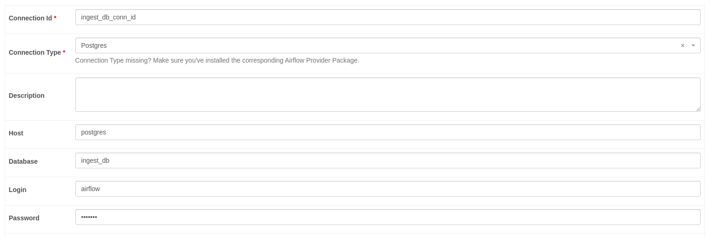
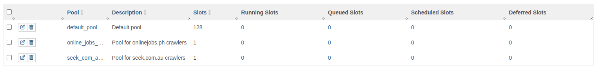
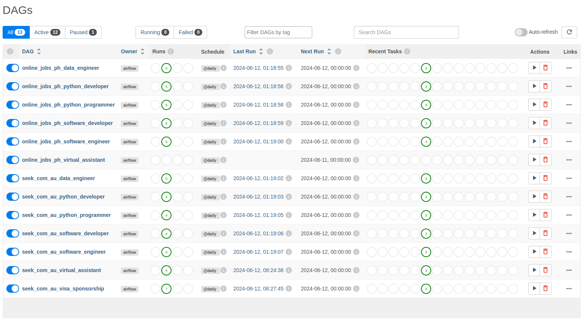

### Table of contents
- [Scalable web crawling using Airflow and Scrapy](#scalable-web-crawling-using-airflow-and-scrapy)
  - [1. Project overview](#1-project-overview)
  - [2. Tech stack](#2-tech-stack)
  - [3. Containers setup](#3-containers-setup)
    - [Docker compose](#docker-compose)
    - [Initializations](#initializations)
    - [Folder structure](#folder-structure)
  - [4. Database setup](#4-database-setup)
  - [5. Scrapy web crawler setup](#5-scrapy-web-crawler-setup)
  - [6. Airflow setup](#6-airflow-setup)
    - [Crawler setup](#crawler-setup)
  
# Scalable web crawling using Airflow and Scrapy
## 1. Project overview

This project demonstrates a scalable web crawler that uses scrapy to crawl multiple websites. The crawlers will be primararily crawling job postings online. The crawlers can be orchestrated to run daily, weekly or monthly. Scraped data as will be stored in a PostgreSQL database. Crawler metadata which includes input query (additional args) will be stored in a table and will be fetch by python script that automatically create DAGs. By just changing the input query, multiple crawling tasks can be created from just one scrapy crawler (i.e. separate DAGs can be created for crawling 'engineer', 'virtual assistant' and 'project manager' job postings but just using one scrapy crawler)

## 2. Tech stack
1. Scrapy for web crawling
2. Airflow for orchestration
3. PostgreSQL for storing scrape json data and crawler metadata
4. Docker to containerize the project components
5. pgAdmin4 to manage the database


## 3. Containers setup
### Docker compose
We will be building our project using the [Airflow docker compose](#https://airflow.apache.org/docs/apache-airflow/stable/howto/docker-compose/index.html) as baseline.
``` bash
$ curl -LfO 'https://airflow.apache.org/docs/apache-airflow/2.9.2/docker-compose.yaml'
```
This file contains several service definitions:
* airflow-scheduler - The scheduler monitors all tasks and DAGs, then triggers the task instances once their dependencies are complete.
* airflow-webserver - The webserver is available at http://localhost:8080.
* airflow-worker - The worker that executes the tasks given by the scheduler.
* airflow-triggerer - The triggerer runs an event loop for deferrable tasks.
* airflow-init - The initialization service.
* postgres - The database.
* redis - The redis - broker that forwards messages from scheduler to worker.

We will also add pgadmin service but this optional. You can user other apps to manage our PostgreSQL database.

### Initializations
Run the following commands to initialize the environment and database. Only need to do this once.
```bash
$ mkdir -p ./dags ./logs ./plugins ./config
$ echo -e "AIRFLOW_UID=$(id -u)" > .env
$ docker compose up airflow-init
```
### Folder structure
The docker compose details the volumes that we need to mount and we are going to need the folders for these volumes: **config, dags, logs, plugins, pgadmin-data, and postgres-data**
``` bash
project_folder
├── config/             
├── dags/               
├── db/                 
├── logs/               
├── pgadmin-data/       
├── plugins/            
├── postgres-data/      
├── .env
├── docker-compose.yml
├── Dockerfile
├── README.md
└── requirements.txt
```
Now we can start all services:
```bash
$ docker compose up
```
## 4. Database setup
Airflow database will already be handled the docker-compose.yml. We will only need to setup the database for the web crawlers, **ingest_db**. **ingest_db** will have the following tables:
1. sources - sources table will contain the details about the sources we are going to crawl. This is mapped 1-to-1 with our scrapy spiders
   * seek_com_au crawler - [seek.com.au](#https://www.seek.com.au)
   * online_jobs_ph crawler - [onlinejobs.ph](#https://www.onlinejobs.ph)
2. crawlers - crawlers table will contain details about our Dags. DAG ids, frequency, pool, and priority weight. It will also contain specific queries for each crawler DAGs.
3. jobs - jobs table will contain the scraped job posting data

Creation of these tables will be automated by adding additional commands on the entry point for the postgres container.
```bash
project_folder
└── db/
    ├── custom-entrypoint.sh
    ├── Dockerfile
    └── jobs.sql
```
Populate the sources tables for the seek_com_au and online_jobs_ph crawlers:
```sql
INSERT INTO jobs.sources ("name", url) VALUES ('seek_com_au', 'https://www.seek.com.au/');
INSERT INTO jobs.sources ("name", url) VALUES ('online_jobs_ph', 'https://www.onlinejobs.ph/');
```
For the crawlers table, you can use the following. Add or remove some entries based on your preference:
```sql
INSERT INTO jobs.crawlers (source_id, "name", crawler_name, args, frequency, enabled, priority, pool) VALUES (2, 'seek_com_au_visa_sponsorship', 'seek_com_au', '-a "query=visa-sponsorship-jobs-in-information-communication-technology"', 'daily', true, 4, 'seek_com_au_pool');
INSERT INTO jobs.crawlers (source_id, "name", crawler_name, args, frequency, enabled, priority, pool) VALUES (2, 'seek_com_au_data_engineer', 'seek_com_au', '-a "query=data engineer-jobs"', 'daily', true, 4, 'seek_com_au_pool');
INSERT INTO jobs.crawlers (source_id, "name", crawler_name, args, frequency, enabled, priority, pool) VALUES (2, 'seek_com_au_python_developer', 'seek_com_au', '-a "query=python developer-jobs"', 'daily', true, 4, 'seek_com_au_pool');
INSERT INTO jobs.crawlers (source_id, "name", crawler_name, args, frequency, enabled, priority, pool) VALUES (2, 'seek_com_au_software_engineer', 'seek_com_au', '-a "query=software engineer-jobs"', 'daily', true, 4, 'seek_com_au_pool');
INSERT INTO jobs.crawlers (source_id, "name", crawler_name, args, frequency, enabled, priority, pool) VALUES (2, 'seek_com_au_software_developer', 'seek_com_au', '-a "query=software developer-jobs"', 'daily', true, 4, 'seek_com_au_pool');
INSERT INTO jobs.crawlers (source_id, "name", crawler_name, args, frequency, enabled, priority, pool) VALUES (2, 'seek_com_au_python_programmer', 'seek_com_au', '-a "query=python programmer-jobs"', 'daily', true, 4, 'seek_com_au_pool');
INSERT INTO jobs.crawlers (source_id, "name", crawler_name, args, frequency, enabled, priority, pool) VALUES (2, 'seek_com_au_virtual_assistant', 'seek_com_au', '-a "query=virtual assistant-jobs"', 'daily', true, 4, 'seek_com_au_pool');
INSERT INTO jobs.crawlers (source_id, "name", crawler_name, args, frequency, enabled, priority, pool) VALUES (1, 'online_jobs_ph_python_developer', 'online_jobs_ph', '-a "query=python developer"', 'daily', true, 4, 'online_jobs_ph_pool');
INSERT INTO jobs.crawlers (source_id, "name", crawler_name, args, frequency, enabled, priority, pool) VALUES (1, 'online_jobs_ph_data_engineer', 'online_jobs_ph', '-a "query=data engineer"', 'daily', true, 4, 'online_jobs_ph_pool');
INSERT INTO jobs.crawlers (source_id, "name", crawler_name, args, frequency, enabled, priority, pool) VALUES (1, 'online_jobs_ph_software_engineer', 'online_jobs_ph', '-a "query=software engineer"', 'daily', true, 4, 'online_jobs_ph_pool');
INSERT INTO jobs.crawlers (source_id, "name", crawler_name, args, frequency, enabled, priority, pool) VALUES (1, 'online_jobs_ph_software_developer', 'online_jobs_ph', '-a "query=software developer"', 'daily', true, 4, 'online_jobs_ph_pool');
INSERT INTO jobs.crawlers (source_id, "name", crawler_name, args, frequency, enabled, priority, pool) VALUES (1, 'online_jobs_ph_python_programmer', 'online_jobs_ph', '-a "query=python programmer"', 'daily', true, 4, 'online_jobs_ph_pool');
INSERT INTO jobs.crawlers (source_id, "name", crawler_name, args, frequency, enabled, priority, pool) VALUES (1, 'online_jobs_ph_virtual_assistant', 'online_jobs_ph', '-a "query=virtual assistant"', 'daily', true, 4, 'online_jobs_ph_pool');
```

## 5. Scrapy web crawler setup
The 2 scrapy spiders are generated using the scrapy genspider command.
``` bash
scrapy genspider seek_com_au seek.com.au
scrapy genspider online_jobs_ph onlinejobs.ph
```
For the settings, let's be gentle to these websites.
```python
CONCURRENT_REQUESTS = 1
DOWNLOAD_DELAY = 3
CONCURRENT_REQUESTS_PER_DOMAIN = 1
CONCURRENT_REQUESTS_PER_IP = 1
```
A user-agent rotator middleware based on the **fake-useragent** is also added to rotate user-agent for each request.  
Each job item scraped will be inserted/updated to the PostgreSQL database using the JobsPipeline pipeline which utilizes **psycopg2**  
The scrapy spiders will be ran using the **scrapy crawl** command and a query will be passed using the -a options. This will be consumed by spider and used as query to the source website  
```bash
$ scrapy crawl online_jobs_ph -a "query=software engineer"
$ scrapy crawl seek_com_au -a "query=python developer"
```

## 6. Airflow setup
Airflow dags are automatically generated using the following python script:
```python
from datetime import timedelta

from airflow import DAG
from airflow.operators.bash_operator import BashOperator
from airflow.operators.dummy_operator import DummyOperator
from airflow.utils.dates import days_ago
from airflow.hooks.postgres_hook import PostgresHook


def fetch_crawler_jobs():
    """
    Fetches crawler jobs from the jobs.crawlers table.
    """
    pg_hook = PostgresHook(postgres_conn_id='ingest_db_conn_id')
    connection = pg_hook.get_conn()
    cursor = connection.cursor()
    cursor.execute(
        """SELECT name, crawler_name, args, frequency, pool, priority
           FROM jobs.crawlers
           WHERE enabled=TRUE
        """
    )
    records = cursor.fetchall()
    cursor.close()
    connection.close()
    return records

def create_dag(name, crawler_name, args, frequency, pool, priority):
    """
    Creates a DAG with dynamically generated Bash tasks based on the job record.
    """
    default_args = {
        'owner': 'airflow',
        'depends_on_past': False,
        'email_on_failure': False,
        'email_on_retry': False,
        'retries': 1,
        'retry_delay': timedelta(minutes=5),
        'start_date': days_ago(1),  # Set the start date appropriately
    }

    dag = DAG(
        name,
        default_args=default_args,
        description='A DAG with dynamically generated Bash tasks',
        schedule_interval=f'@{frequency}',  # Schedule to run daily,
        catchup=False
    )

    start = DummyOperator(task_id='start', dag=dag)
    end = DummyOperator(task_id='end', dag=dag)

    crawl_task = BashOperator(
        task_id=f'job_{name}',
        bash_command=f"scrapy crawl {crawler_name} {args}",
        cwd='/opt/airflow/dags/jobs',
        pool=pool,
        priority_weight=priority,
        dag=dag,
    )

    start >> crawl_task >> end

    return dag

# Fetch job records from the database
crawler_jobs = fetch_crawler_jobs()

# Create a DAG for each job record
for (name, crawler_name, args, frequency, pool, priority) in crawler_jobs:
    globals()[name] = create_dag(name, crawler_name, args, frequency, pool, priority)
```
For this to work, we need to add the ingest_db_conn_id connection in the airflow web interface **(Admin > Connections)**
```json
{
    "Connection Id": "ingest_db_conn_id",
    "Connection Type": "Postgres",
    "Host": "postgres",
    "Database": "ingest_db",
    "Login": "airflow",
    "Password": "airflow",
}
```


For each sources, we will also assign a pool with 1 slots each **(Admin > Pools)**


By using the initially provided crawler configs, the following dags will be generated


### Crawler setup
To be able to run the following scrapy crawler at a daily frequency with priority weight of 4:
```bash
$ scrapy crawl online_jobs_ph -a "query=software engineer"
```
Requires inserting the following entry to the jobs.crawlers table:
```sql
INSERT INTO jobs.crawlers (source_id, "name", crawler_name, args, frequency, enabled, priority, pool) VALUES (1, 'online_jobs_ph_software_engineer', 'online_jobs_ph', '-a "query=software engineer"', 'daily', true, 4, 'online_jobs_ph_pool');
```
Notice scrapy crawl arguments **-a "query=software engineer"** is added as args in the jobs.crawler table.  
Priority weights can configured on crawlers table to set which crawlers to prioritize running first. Slots in the pools can also be increased as needed to allow running multiple crawlers from each source to run simulataneously.